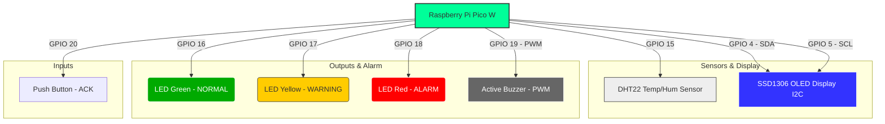

# ❄️ ColdGuard Multi-Site
### Smart Cold-Chain Telemetry & Monitoring System

ระบบติดตาม อัปเดต และเฝ้าระวังอุณหภูมิและความชื้นของตู้แช่เย็น (Cold-Chain) แบบเวลาจริง (Real-time) รองรับการบริหารจัดการแยกตาม **Multi-Site** พร้อมจัดเก็บประวัติข้อมูลลงระบบคลาวด์ **Firebase Firestore** เพื่อนำมาวิเคราะห์ในรูปแบบกราฟเส้นได้อย่างแม่นยำ

---

## 🚀 ฟีเจอร์เด่นของระบบ (Key Features)

* **🏢 รองรับโครงสร้าง Multi-Site (หลายไซต์งาน):** จัดกลุ่มตู้แช่และคัดกรองข้อมูลตามแต่ละสถานที่หรืออาคารอย่างเป็นระบบด้วยโครงสร้างหัวข้อ MQTT
* **📡 การสื่อสาร Real-time ผ่าน MQTT:** เชื่อมโยงและแลกเปลี่ยนข้อมูลความเย็นจากอุปกรณ์ IoT (บอร์ดจำลอง MicroPython Pico W) อย่างฉับไวแบบเสี้ยววินาที ผ่านระบบ Public EMQX Broker
* **🔥 จัดเรียงความสำคัญตามระดับความรุนแรง (Priority Sorting):** แสดงผลตู้แช่ที่มีสถานะอันตรายขึ้นก่อนเรียงลำดับจาก `ALARM` / `CRITICAL` 🔴 -> `WARNING` 🟡 -> `NORMAL` 🟢 -> `OFFLINE` ⚪ เพื่อให้ผู้ดูแลระบบมองเห็นและเข้าแก้ไขปัญหาได้ทันท่วงที
* **🔕 ส่งคำสั่งควบคุมกลับไปยังอุปกรณ์ (Mute Commands):** สามารถสั่งการปิดเสียงแจ้งเตือน (Buzzer Mute) แบบเจาะจงรายบอร์ดข้ามไซต์จากตัวแอปพลิเคชันได้โดยตรง
* **💾 บันทึกประวัติบนคลาวด์อัตโนมัติ (Automated Firebase Sync):** เก็บข้อมูลสภาพแวดล้อมจากทุกๆ ไซต์งานลงในฐานข้อมูล **Cloud Firestore** ทุกๆ 1 นาที เพื่อประหยัดแบนด์วิดท์และรักษาประวัติข้อมูลได้อย่างปลอดภัย
* **📊 กราฟวิเคราะห์แนวโน้มข้อมูล (Historical Analytics Charts):** มาพร้อมหน้าจอแสดงประวัติในรูปแบบกราฟเส้น (`fl_chart`) สามารถฟิลเตอร์ดูพฤติกรรมข้อมูลย้อนหลังแยกตาม Site และแยกระหว่างกราฟอุณหภูมิ (°C) หรือ ความชื้น (%) ได้อย่างชัดเจน

---

## 🗺️ สถาปัตยกรรมระบบผังการไหลของข้อมูล (System Architecture)

ระบบประกอบด้วยโครงสร้างการเชื่อมต่อข้อมูลแบบกระจายศูนย์ (Distributed IoT Network) ตามแผนผังด้านล่างนี้:

```mermaid
graph LR
    subgraph IoT Devices (Raspberry Pi Pico W)
        P1(Pico W - Site 1)
        P2(Pico W - Site 2)
        PN(Pico W - Site N)
    end

    Broker[MQTT Broker <br> broker.emqx.io]
    App[Mobile Application <br> Flutter / Dart]
    DB[(Firebase Cloud <br> Firestore Database)]

    P1 -->|Publish Telemetry| Broker
    P2 -->|Publish Telemetry| Broker
    PN -->|Publish Telemetry| Broker

    Broker <-->|Subscribe & Control Commands| App
    App <-->|Sync Every 1 Minute| DB

    style Broker fill:#f96,stroke:#333,stroke-width:2px
    style App fill:#ff5,stroke:#333,stroke-width:2px
    style DB fill:#f66,stroke:#333,stroke-width:2px
    style P1 fill:#69f,stroke:#333,stroke-width:1px
    style P2 fill:#69f,stroke:#333,stroke-width:1px
    style PN fill:#69f,stroke:#333,stroke-width:1px
```

### การไหลของข้อมูล (Data Flow Explanation):
1. **ฝั่งอุปกรณ์ (IoT Nodes):** บอร์ด **Raspberry Pi Pico W** จำนวน 1, 2 ถึง N ตัว (แยกอิสระตามแต่ละไซต์งาน) ทำหน้าที่วัดผลอุณหภูมิและความชื้น แล้วทำการส่งสัญญาณ (`Publish`) ข้อมูลออกไป
2. **ตัวกลางสื่อสาร (MQTT Broker):** ใช้ **EMQX Broker** ทำหน้าที่เป็นตัวรับ-ส่งข้อมูลหลักแบบ Real-time ข้อมูลจะวิ่งเข้า-ออกตาม Topic โครงสร้าง `coldchain1/{siteId}/{deviceId}/telemetry`
3. **แอปพลิเคชันมือถือ (Mobile Application):** แอปพลิเคชัน Flutter เชื่อมต่อกับ MQTT Broker ตลอดเวลา เพื่อนำข้อมูลตู้แช่จากทุกๆ ไซต์มาประมวลผลจัดกลุ่มแสดงบน UI ทันที รวมถึงส่งคำสั่งควบคุม (`Command`) กลับไปยังอุปกรณ์
4. **ฐานข้อมูลคลาวด์ (Cloud Firebase):** ทุกๆ 1 นาที ตัวแอปพลิเคชันมือถือจะทำการรวบรวมสถานะของทุกตู้แช่แล้วอัปโหลดขึ้นไปฝากบันทึกไว้ที่ **Firebase Firestore** เพื่อทำเป็นฐานข้อมูลประวัติย้อนหลังถาวร

---

## 🔌 การต่อวงจรอุปกรณ์ฮาร์ดแวร์จำลอง (Hardware Circuit Mapping)

แผนผังการต่อสายอุปกรณ์เซ็นเซอร์และสัญญาณแจ้งเตือนเข้ากับบอร์ด **Raspberry Pi Pico W** จากตัวจำลองจำลองระบบ (Wokwi Simulation):



### 📋 ตารางสรุปขาการเชื่อมต่อพิน (Pin Mapping Table)

| ชื่ออุปกรณ์ (Component) | ขาของอุปกรณ์ (Pin) | ขาบนบอร์ด Pico W (GPIO) | รายละเอียด/หน้าที่ (Function) |
| :--- | :--- | :--- | :--- |
| **DHT22 Sensor** | Data Pin | **GPIO 15** | อ่านค่าอุณหภูมิและความชื้นสัมพัทธ์ในตู้แช่ |
| **SSD1306 OLED** | SDA | **GPIO 4** | สายสัญญาณข้อมูลสำหรับการสื่อสาร I2C |
| **SSD1306 OLED** | SCL | **GPIO 5** | สายสัญญาณนาฬิกาสำหรับการสื่อสาร I2C |
| **LED สีเขียว** | Anode (+) | **GPIO 16** | เปิดเมื่อตู้แช่อยู่ในสถานะปลอดภัย (`NORMAL`) |
| **LED สีเหลือง** | Anode (+) | **GPIO 17** | เปิดเมื่อตู้แช่อยู่ในสถานะเตือนภัย (`WARNING` / `CRITICAL`) |
| **LED สีแดง** | Anode (+) | **GPIO 18** | เปิดเมื่อตู้แช่อยู่ในสถานะอันตรายรุนแรง (`ALARM`) |
| **Buzzer** | Positive (+) | **GPIO 19 (PWM)** | ส่งเสียงแจ้งเตือนอุณหภูมิวิกฤต (ความถี่ 2kHz) |
| **Push Button** | Terminal 1 | **GPIO 20** | ปุ่มกดเคลียร์/ปิดเสียงแจ้งเตือนเฉพาะหน้างาน (`ACK`) |

---

## 🛠️ โครงสร้างเทคโนโลยี (Tech Stack)

* **Frontend Framework:** Flutter (Dart) - สถาปัตยกรรมแบบข้ามแพลตฟอร์ม (Android / iOS)
* **State Management:** Provider (ChangeNotifier) - ลื่นไหล ตอบสนองข้อมูลแบบ Real-time
* **Cloud Database:** Firebase Firestore - สำหรับเก็บเอกสารประวัติข้อมูลชุดตัวเลข
* **IoT Protocols:** MQTT Client (umqttsimple ในฝั่งบอร์ด / mqtt_client ในฝั่ง Flutter)
* **Data Visualization:** FL Chart - กราฟเส้นแบบโต้ตอบและตอบสนองได้ดี

---

## 📦 โครงสร้างสถาปัตยกรรมซอร์สโค้ด (Project Architecture)

โครงสร้างซอร์สโค้ดในโฟลเดอร์หลัก `lib/` ได้รับการจัดรูปแบบอย่างเป็นสัดส่วนตามหลัก Clean Code:

```text
lib/
├── main.dart                 # ไฟล์จุดเริ่มต้นของแอปพลิเคชันและการเปิดตัวระบบ Firebase
├── models/
│   └── fridge_telemetry.dart # โมเดลจัดการข้อมูลตู้แช่ อุณหภูมิ ความชื้น และระดับสิทธิ์ของ Site
├── providers/
│   └── coldchain_provider.dart # ตัวจัดการ State รับค่า MQTT, สั่งบัฟเฟอร์ Timer 1 นาทีเข้า Firebase
├── services/
│   ├── firebase_service.dart # เซอร์วิสส่งข้อมูลดิบและเซิร์ฟเวอร์ Timestamp ขึ้นคลาวด์ Firestore
│   └── mqtt_service.dart     # เซอร์วิสการรับ/ส่ง และแปลงคำสั่งคุยกับบอร์ดจำลอง Pico W
├── screens/
│   ├── dashboard_screen.dart # หน้าแรกแสดงแผงควบคุมหลัก สรุปยอด และ Section แยกตามราย Site
│   └── history_screen.dart   # หน้าจอประวัติสืบค้นแบบกราฟเส้น พร้อมลิสต์ Dropdown ตัวกรอง
└── widgets/
    └── fridge_card.dart      # คอมโพเนนต์การ์ดแสดงผลตู้แช่ เทอร์โมมิเตอร์ และปุ่มควบคุมเสียง
```

---

## ⚙️ วิธีการเริ่มต้นใช้งาน (Getting Started)

### 1. การเตรียมความพร้อมทางฝั่งเครือข่ายและความปลอดภัย
1. ดาวน์โหลดไฟล์คอนฟิก `google-services.json` จากโปรเจกต์คอนโซล Firebase ของคุณ
2. นำไปวางในโฟลเดอร์โครงการแอนดรอยด์ที่ตำแหน่ง `android/app/google-services.json`
3. ไปที่หน้า Firebase Console > Firestore Database แล้วกดเปิดใช้งาน (Enable) ฐานข้อมูลใน **Test Mode**

### 2. การเริ่มทำงานบอร์ดจำลอง (Pico W MicroPython)
* แก้ไขตัวแปร `SITE_ID` และ `DEVICE_ID` ในไฟล์สคริปต์ของบอร์ด เพื่อแบ่งแยกความแตกต่างของแต่ละอุปกรณ์ (เช่น `site-bkk-01`, `site-bkk-02`) จากนั้นกดเริ่มสตรีมข้อมูลสัญญาณผ่าน Wokwi Simulator

### 3. การเปิดใช้งานตัวแอปพลิเคชัน Flutter
ทำสั่งรันคำสั่งเหล่านี้ผ่านเทอร์มินัลหรือกดปุ่ม Run บน Android Studio:
```bash
flutter pub get
flutter run
```

---

## 🔒 ความปลอดภัยของซอร์สโค้ด (Git Security)
* โครงการนี้ได้รับการอัปเดตไฟล์ `.gitignore` ให้ทำการ**ข้ามและปกป้องข้อมูลสำคัญ**อย่าง `google-services.json` และไฟล์ข้อมูลความปลอดภัยส่วนบุคคลไม่ให้หลุดขึ้นสู่คลังเก็บโค้ดระบบสาธารณะเรียบร้อยแล้ว
